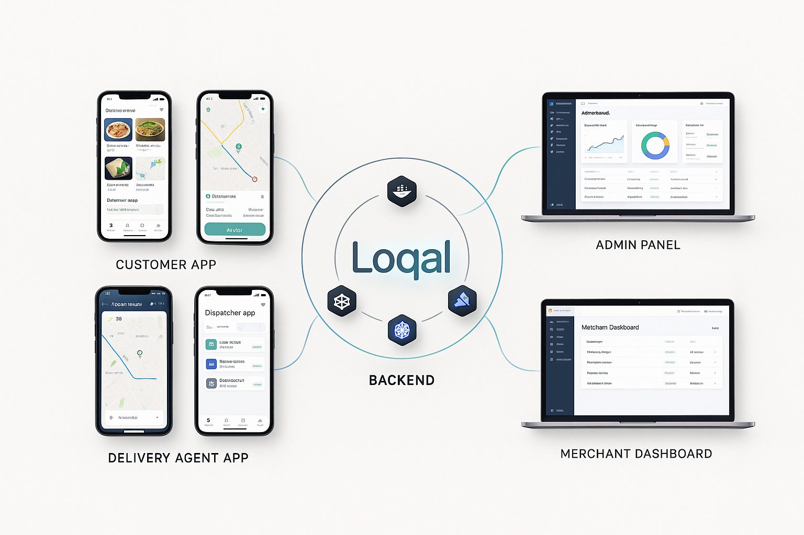

# Loqal - Full Stack SaaS Platform

**Loqal** is a powerful, multi-tenant SaaS platform designed to empower local businesses and startups with a feature-rich, cost-effective digital presence. Built on a modern microservices architecture, it provides a complete ecosystem including a robust backend, native mobile apps, and a suite of web applications for seamless online operations.

---

## 🎯 Full Platform Vision

The Loqal ecosystem is composed of three main parts: a powerful backend, a suite of native mobile applications for users on the go, and a collection of web frontends for management and e-commerce.

### 📱 Native Mobile Apps (iOS & Android)

To provide the best performance and user experience, three distinct native applications will be developed for both iOS (using Swift) and Android (using Kotlin).

* **Customer App**: The primary interface for end-users to browse products, place orders, make payments, and track deliveries in real-time.
* **Delivery App**: A tool for delivery agents to manage their availability, receive assignments, navigate to locations, and communicate with customers and dispatchers.
* **Dispatcher App**: An internal application for store staff to manage incoming orders, pack items, and coordinate handovers with delivery agents.

### 💻 Web Applications

Five distinct web frontends will be developed to serve various business and administrative needs:

* **Loqal Landing Page**: The main marketing and informational website for the Loqal platform itself.
* **Admin Dashboard**: A comprehensive internal tool for platform administrators to manage merchants, users, system settings, and view platform-wide analytics.
* **Merchant Dashboard**: A self-service portal for business owners to manage their product catalog, inventory, promotions, orders, and view sales analytics.
* **Merchant Storefront Page**: A customizable public-facing landing page for each individual merchant on the platform.
* **Merchant Online Store**: A fully functional e-commerce website for each merchant, allowing customers to browse and purchase products directly.

---

## 🎯 Core Features

The platform is designed to serve multiple user roles, each with a dedicated set of features:

* **Customers**:
    * Login/Signup via phone, email, or Google.
    * Browse items by category and place orders.
    * Real-time chat and call with delivery agents and dispatchers.
    * Track deliveries in real-time and rate stores/agents.
    * Manage wallet, saved addresses, and order history.
* **Delivery Agents**:
    * Clock in/out for availability.
    * Receive order assignments based on algorithms and manual dispatch.
    * Geofencing to get more orders when near delivery locations.
    * Communicate with customers and dispatchers.
* **Dispatchers/Store Staff**:
    * Receive customer orders, pack items, and manage handovers to delivery agents with OTP verification.
    * Communicate with delivery agents.
* **Merchants/Businesses**:
    * Manage their online store, including product catalogs and inventory.
    * Run promotions and discounts.
    * Access analytics and sales reports.
* **Platform Admins**:
    * Onboard new businesses and manage employees.
    * Monitor overall platform operations and analytics.
    * Manage system-wide configurations and promotions.

---

## 🏗️ Backend Architecture Overview

The backend is a collection of small, independent, and loosely coupled microservices. This design ensures scalability, resilience, and maintainability.

### Services

| Service               | Language | Core Responsibility                                                               |
| :-------------------- | :------- | :-------------------------------------------------------------------------------- |
| **Auth Service** | Java     | Handles user authentication, registration, and JWT management.                    |
| **User Service** | Java     | Manages user profiles, roles, and addresses.                                      |
| **Product Service** | Java     | Manages product catalogs, categories, and details.                                |
| **Inventory Service** | Java     | Manages stock levels, reservations, and updates.                                  |
| **Order Service** | Java     | Manages the complete lifecycle of customer orders.                                |
| **Payment Service** | Java     | Processes payments, manages wallets, and integrates with Razerpay.    |
| **Delivery Service** | Java     | Manages delivery assignments, agent tracking, and geofencing using Google Maps API. |
| **Promotion Service** | Java     | Manages discounts, coupons, and promotional campaigns.                            |
| **Merchant Service** | Java     | Handles merchant-specific data and dashboard functionalities.                     |
| **Admin Service** | Java     | Provides APIs for the platform admin dashboard to manage the system.              |
| **Notification Service**| Node.js  | Sends real-time alerts (Push, SMS, Email) via WebSockets and message queues.      |
| **Chat Service** | Node.js  | Facilitates real-time chat between users via WebSockets.                          |
| **Analytics Service** | Node.js  | Collects and processes event data for reporting and insights.                     |

### Communication Flow

Services communicate via REST APIs for synchronous requests and a message broker (Kafka) for asynchronous, event-driven interactions. Real-time updates are handled via WebSockets. All external traffic is routed through **Kong**, which acts as the API Gateway.
```plaintext
CLIENT → KONG → AUTH → USER ─────┐
↓             ↓            │
WS/REST     JWT Issuer     Fetch roles/tenant
↓                          ↓
ORDER ─── REST ───> INVENTORY
│               ↳ PRODUCT (for details)
│
└── Kafka ───> NOTIFICATION
↳ ANALYTICS
↳ PAYMENT (sync + async)
```

---

## 🛠️ Technology Stack

| Category         | Technology                                       |
| :--------------- | :----------------------------------------------- |
| **Backend** | Java (Spring Boot), Node.js (Express/NestJS) |
| **Mobile** | Swift (iOS), Kotlin (Android) |
| **Web** | React.js |
| **API Gateway** | Kong                                             |
| **Databases** | PostgreSQL/MySQL (Relational), MongoDB (NoSQL), Redis (Cache/Real-time) |
| **Message Broker**| Kafka / RabbitMQ                                 |
| **Infrastructure**| Docker, Kubernetes                               |
| **CI/CD** | GitHub Actions                                   |
| **Monitoring** | Prometheus, Grafana, ELK Stack                   |
| **API Docs** | OpenAPI / Swagger                                |

---

## 🚀 Project Roadmap & Status

The project is being developed in phases.

1.  **Phase 1: Backend Services (In Progress)**
    * **Status**: The core backend microservices have been developed. Work is currently focused on integrating the **Kong API Gateway** and establishing a comprehensive **Observability** stack (logging, tracing, metrics).

2.  **Phase 2: Mobile & Web Applications (Upcoming)**
    * **Status**: This phase will commence after the backend is stable. It will involve the parallel development of the native iOS/Android applications and the five web frontends.

---

## ⚙️ Getting Started

### Prerequisites

* Java 17+
* Node.js 20+
* Docker & Docker Compose
* Kubernetes (minikube recommended for local setup)
* `kubectl`

### Setup & Installation

1.  **Clone the repository:**
    ```bash
    git clone https://github.com/anubhav-auth/Loqal.git
    cd loqal
    ```

2.  **Configuration:**
    Externalize all configurations (e.g., database connection strings, API keys) using environment variables or Kubernetes ConfigMaps and Secrets. Refer to the `infra/config/` directory for environment-specific templates.

3.  **Build Docker Images:**
    Each service contains a `Dockerfile`. To build an image:
    ```bash
    # Example for a Java service
    docker build -t your-registry/auth-service:latest ./backend/java/auth-service
    ```

4.  **Run with Docker Compose (for local development):**
    The `docker-compose.yml` file orchestrates the services for a local environment.
    ```bash
    docker-compose up -d
    ```

---

## 📁Proposed Repository Structure

```plaintext
Loqal/
├── apps/
│   ├── android/
│   │   ├── customer-app/
│   │   ├── delivery-app/
│   │   └── merchant-app/
│   └── ios/
│       ├── customer-app/
│       ├── delivery-app/
│       └── merchant-app/
├── web/
│   ├── landing-pages/
│   │   ├── variant-a/
│   │   └── variant-b/
│   ├── dashboards/
│   │   ├── variant-a/
│   │   └── variant-b/
│   └── storefront/
├── backend/
│   ├── java/
│   │   ├── auth-service/
│   │   │   ├── src/
│   │   │   └── tests/
│   │   ├── user-service/
│   │   │   ├── src/
│   │   │   └── tests/
│   │   ├── product-service/
│   │   │   ├── src/
│   │   │   └── tests/
│   │   ├── payment-service/
│   │   │   ├── src/
│   │   │   └── tests/
│   │   ├── admin-service/
│   │   │   ├── src/
│   │   │   └── tests/
│   │   └── order-service/
│   │       ├── src/
│   │       └── tests/
│   ├── node/
│   │   ├── notification-service/
│   │   │   ├── src/
│   │   │   └── tests/
│   └── database/
│       ├── migrations/
│       └── seeds/
├── infra/
│   ├── config/
│   │   ├── dev/
│   │   ├── staging/
│   │   └── prod/
│   ├── docker/
│   │   └── dockerfiles/
│   ├── nginx/
│   │   ├── api-gateway.conf
│   │   └── ssl/
│   ├── kong/
│   │   ├── declarative/
│   │   └── plugins/
│   └── k8s/
│       ├── manifests/
│       └── helm/
├── docs/
│   ├── architecture.md
│   ├── api-spec.yaml
│   └── setup.md
├── scripts/
│   ├── setup.sh
│   ├── deploy.sh
│   └── migrate.sh
├── tests/
│   ├── unit/
│   └── integration/
├── .github/
│   └── workflows/
│       ├── ci.yml
│       └── cd.yml
├── docker-compose.yml
├── .gitignore
├── README.md
└── package.json
```


---

## 🤝 Contributing

Contributions are welcome! Please feel free to open an issue or submit a pull request.

1.  **Fork** the repository.
2.  Create your feature branch (`git checkout -b feature/AmazingFeature`).
3.  Commit your changes (`git commit -m 'Add some AmazingFeature'`).
4.  Push to the branch (`git push origin feature/AmazingFeature`).
5.  Open a **Pull Request**.
